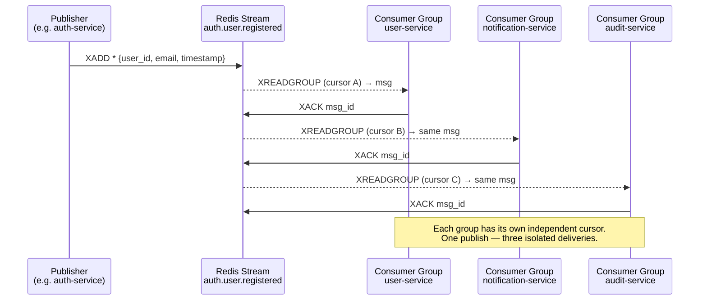

# Event Bus — Redis Streams

## Core concept

Every service publishes to a **named stream** once. Any number of services can
consume that stream independently via **consumer groups**. The publisher has no
knowledge of who is listening — adding a new consumer never requires touching
publisher code.

```
XADD auth.user.registered * user_id <id> email <email> ...
         │
         ▼
┌─────────────────────────────┐
│  Stream: auth.user.registered│
└─────────────────────────────┘
         │
         ├─ Consumer Group: user-service         → own cursor, own ACK
         ├─ Consumer Group: notification-service → own cursor, own ACK
         └─ Consumer Group: audit-service        → own cursor, own ACK
```

Each group tracks its own position. One publish → N independent deliveries,
zero coordination between consumers.

---

## Standard envelope fields

Every event payload **must** include these two fields regardless of domain:

| Field | Type | Description |
|---|---|---|
| `source_service` | string | Service ID of the publisher (e.g. `"auth-service"`, `"api-gateway"`) |
| `timestamp` | ISO 8601 | UTC time the event was emitted |

For events triggered **by a service-to-service call** (i.e. the action on service B was initiated by service A), two additional fields must be included:

| Field | Type | Description |
|---|---|---|
| `issuer_service` | string | Service ID that made the outbound call (the caller) |
| `issued_to_service` | string | Service ID that received and processed the call (the callee) |

These mirror the JWT claims (`sub` = issuer service) and let the audit trail answer
"which service caused this action" — not just "which service published the event".

---

## Publishing an event

Any service that needs to emit an event calls `XADD` on the relevant stream key:

```python
await redis.xadd(
    "auth.user.registered",   # stream key (one per event type)
    {
        # --- standard envelope (required on every event) ---
        "source_service": settings.SERVICE_ID,
        "timestamp":      datetime.utcnow().isoformat(),

        # --- domain fields ---
        "user_id":        str(user.id),
        "email":          user.email,
    },
    maxlen=50_000,            # cap stream length (trim oldest)
    approximate=True,
)
```

Rules:
- **One stream per event type** (e.g. `auth.user.registered`, `team.deleted`)
- Payload is a flat `dict[str, str]` — no nested objects; serialize complex
  values to JSON strings if needed
- Never include secrets (tokens, passwords) in the payload — only IDs and
  non-sensitive metadata
- Always include `source_service` and `timestamp`; add `issuer_service` /
  `issued_to_service` when the event was triggered by an s2s call

---

## Consuming events — replica-aware

Each subscriber service creates a consumer group on startup (idempotent). With
multiple replicas, every replica is a **distinct consumer within the same group**
— Redis distributes messages across them (competing consumers). No replica
receives a message that another has already claimed.

```
Stream: auth.user.registered
│
└─ Consumer Group: notification-service
        ├── Consumer: notification-service-a1b2c3  (replica 1)
        ├── Consumer: notification-service-d4e5f6  (replica 2)
        └── Consumer: notification-service-g7h8i9  (replica 3)
              Each replica claims different messages — no duplicates.
```

### Deriving a unique worker ID per replica

Docker sets the container hostname to the short container ID automatically. Use
it to build a stable, unique consumer name without any coordination:

```python
import socket

# e.g. "notification-service-a1b2c3d4e5f6"
WORKER_ID = f"{settings.service_id}-{socket.gethostname()}"
```

### Consumer loop

```python
STREAM    = "auth.user.registered"
GROUP     = "notification-service"           # same across all replicas
WORKER_ID = f"{settings.service_id}-{socket.gethostname()}"  # unique per replica

# 1. Create consumer group (idempotent — safe to call from every replica)
try:
    await redis.xgroup_create(STREAM, GROUP, id="0", mkstream=True)
except ResponseError:
    pass  # group already exists — fine

# 2. Read loop (each replica runs its own)
while True:
    messages = await redis.xreadgroup(
        GROUP, WORKER_ID,
        {STREAM: ">"},   # ">" = only new, unclaimed messages
        count=10,
        block=5000,      # block up to 5s waiting for messages
    )

    for stream, entries in (messages or []):
        for msg_id, payload in entries:
            try:
                await handle_event(payload)
                await redis.xack(STREAM, GROUP, msg_id)  # commit on success
            except Exception:
                logger.exception("Failed to process %s on %s", msg_id, WORKER_ID)
                # do NOT ack — message stays in PEL for reclaim
```

---

## Retry and dead-letter handling — replica-safe

Unacknowledged messages accumulate in the group's **Pending Entries List
(PEL)**. A reclaim task runs on every replica periodically. `XAUTOCLAIM` is
**atomic** — if two replicas run it simultaneously, each message is claimed by
exactly one of them. No duplicate processing.

```python
RECLAIM_AFTER_MS = 30_000   # retry if idle > 30 seconds
MAX_RETRIES      = 5

async def reclaim_pending():
    # XAUTOCLAIM atomically steals messages idle > RECLAIM_AFTER_MS
    # and assigns them to this replica's WORKER_ID.
    # Safe to run on every replica simultaneously.
    pending = await redis.xautoclaim(
        STREAM, GROUP, WORKER_ID,
        min_idle_time=RECLAIM_AFTER_MS,
        start_id="0-0",
        count=10,
    )
    for msg_id, payload in pending.messages:
        delivery_count = int(payload.get("_delivery_count", 1))

        if delivery_count >= MAX_RETRIES:
            await move_to_dead_letter(STREAM, msg_id, payload)
            await redis.xack(STREAM, GROUP, msg_id)
            continue

        payload["_delivery_count"] = str(delivery_count + 1)
        try:
            await handle_event(payload)
            await redis.xack(STREAM, GROUP, msg_id)
        except Exception:
            logger.warning("Reclaim attempt %d failed for %s", delivery_count, msg_id)
```

Dead-letter messages are written to `dead-letter:<stream>:<group>` for manual
inspection and replay.

### Why `XAUTOCLAIM` is safe across replicas

`XAUTOCLAIM` is a single atomic Redis command. Two replicas racing on it will
each get a **different** set of messages — the first to claim a message ID owns
it until it ACKs or it becomes idle again.

---

## Consumer group isolation

Each service's failures are fully isolated, and replicas within a service
distribute work automatically:

| Scenario | Behaviour |
|---|---|
| `notification-service` crashes | Its PEL grows; `audit-service` unaffected |
| `audit-service` is slow | `notification-service` progresses at its own pace |
| New service added | Creates its own group with `id="$"` (from now) or `id="0"` (replay all) |
| Publisher changes payload | Consumers ignore unknown fields gracefully |
| Replica added (scale up) | New container joins group under its own `WORKER_ID`; Redis starts routing messages to it immediately |
| Replica removed (scale down) | Its PEL entries become idle after `RECLAIM_AFTER_MS`; surviving replicas claim them via `XAUTOCLAIM` |
| Two replicas race on reclaim | `XAUTOCLAIM` is atomic — each message is claimed by exactly one replica |

---

## Startup group bootstrap

Every consumer service must call `xgroup_create` on **all streams it subscribes
to** at startup. Centralise this in a `lifespan` FastAPI handler:

```python
SUBSCRIPTIONS = [
    "auth.user.registered",
    "billing.payment.failed",
]
SERVICE_GROUP = "notification-service"

@asynccontextmanager
async def lifespan(app: FastAPI):
    for stream in SUBSCRIPTIONS:
        try:
            await redis.xgroup_create(stream, SERVICE_GROUP, id="0", mkstream=True)
        except ResponseError:
            pass  # already exists
    yield
```

---

## Stream naming convention

```
<domain>.<entity>.<past-tense-verb>

auth.user.registered
auth.user.password_reset
user.profile.updated
user.account.deleted
team.member.invited
team.member.joined
team.member.removed
team.deleted
billing.subscription.activated
billing.subscription.cancelled
billing.payment.failed
file.uploaded
file.deleted
```

---

## Full event catalogue

| Stream | Publisher | Consumer groups |
|---|---|---|
| `auth.access.denied` | api-gateway | audit-service |
| `auth.service.token_issued` | auth-service | audit-service |
| `auth.user.registered` | auth-service | user-service · notification-service · audit-service |
| `auth.user.password_reset` | auth-service | notification-service · audit-service |
| `auth.user.mfa_changed` | auth-service | notification-service · audit-service |
| `user.profile.updated` | user-service | audit-service |
| `user.account.deleted` | user-service | team-service · file-service · audit-service |
| `team.member.invited` | team-service | notification-service · audit-service |
| `team.member.joined` | team-service | notification-service · audit-service |
| `team.member.removed` | team-service | notification-service · audit-service |
| `team.deleted` | team-service | billing-service · audit-service |
| `billing.subscription.activated` | billing-service | notification-service · audit-service |
| `billing.subscription.cancelled` | billing-service | notification-service · audit-service |
| `billing.payment.failed` | billing-service | notification-service · audit-service |
| `file.uploaded` | file-service | audit-service |
| `file.deleted` | file-service | audit-service |

### `auth.access.denied` — payload schema

Published by the **api-gateway** whenever a user JWT is rejected. Never
published for service-to-service failures (caller identity unverifiable).

| Field | Type | Description |
|---|---|---|
| `source_service` | string | Always `"api-gateway"` |
| `timestamp` | ISO 8601 | UTC time of the rejection |
| `ip` | string | Client IP address |
| `endpoint` | string | Request path (e.g. `/users/me`) |
| `method` | string | HTTP method |
| `reason` | string | `expired` · `invalid_signature` · `missing` · `wrong_type` |

`user_id` is intentionally absent — the token may not be decodable.

---

### `auth.service.token_issued` — payload schema

Published by **auth-service** every time a service JWT is successfully issued.
Allows the audit trail to track which services are authenticating and when tokens
are cycled.

| Field | Type | Description |
|---|---|---|
| `source_service` | string | Always `"auth-service"` |
| `timestamp` | ISO 8601 | UTC time of issuance |
| `issuer_service` | string | `auth-service` — the service that created the token |
| `issued_to_service` | string | The `service_id` the token was issued for (e.g. `"user-service"`) |
| `token_jti` | string | Unique JWT ID (use `jti` claim in the JWT) — correlates token to audit event |
| `expires_at` | ISO 8601 | Token expiry time (`iat + 300s`) |

`token_jti` maps 1:1 to the JWT so any downstream service can reference the
same token in logs without re-emitting sensitive data.

---

## Mermaid diagram


