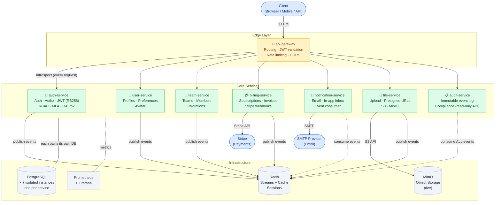
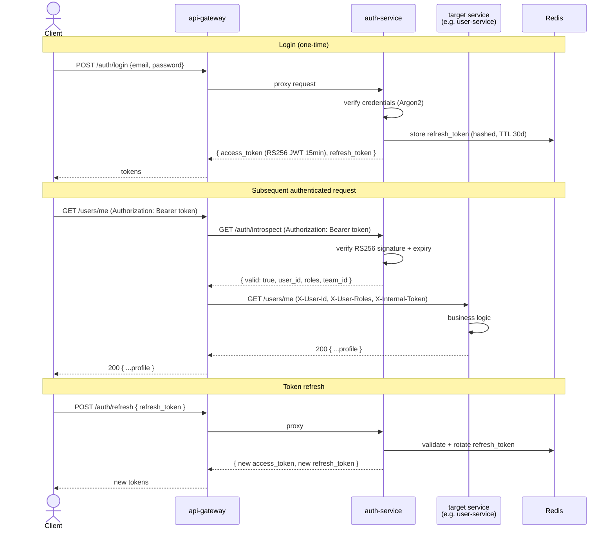
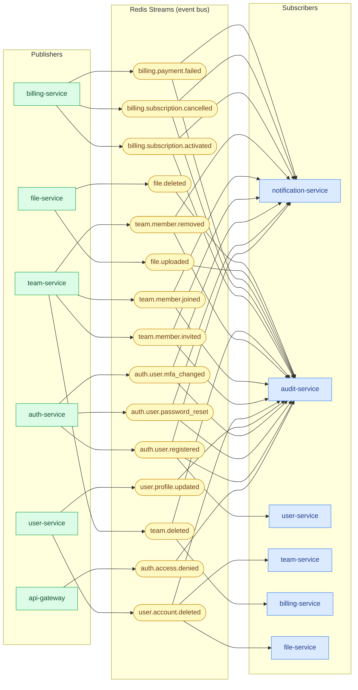
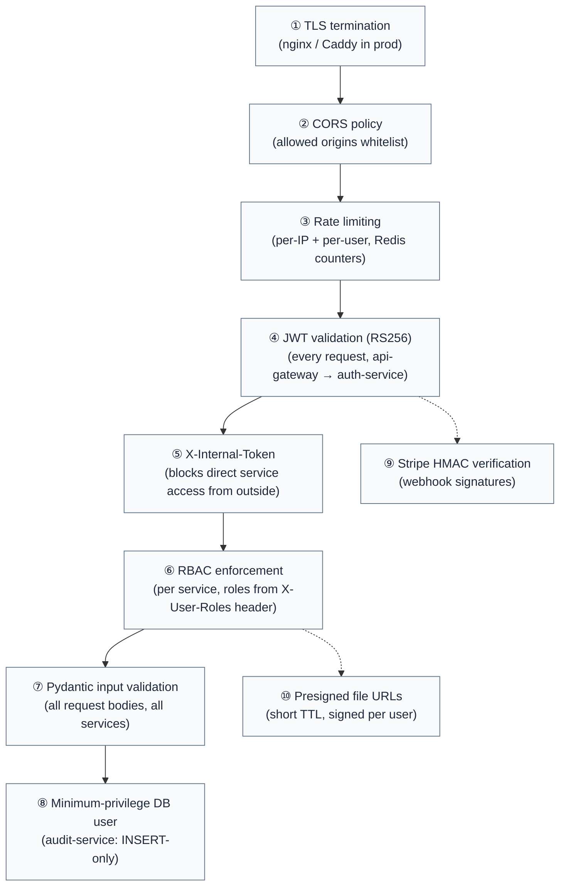

# EvoFrame — Architecture Diagrams

## 1. Service Topology

Full platform view showing all services, infrastructure, and external dependencies.

---

## 2. Request / Authentication Flow

How a typical authenticated API request flows through the platform.

---

## 3. Redis Streams — Event Bus

Which services publish and consume which event streams.

---

## 4. Security Layers

Defense-in-depth from the client to the database.

