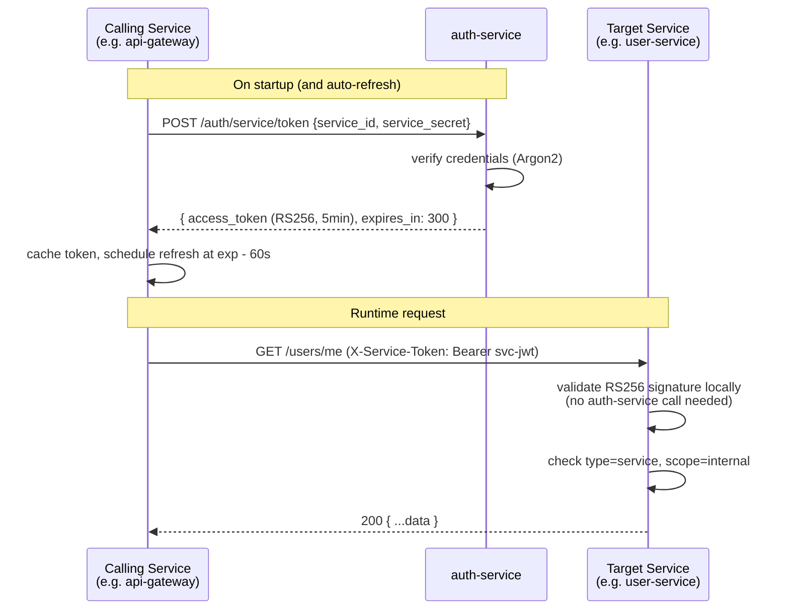

# Service-to-Service Authentication

## Overview

Service-to-service calls use **short-lived RS256 JWTs issued by `auth-service`**
(machine-to-machine tokens). Each service authenticates once with its own
credentials, receives a token, caches it, and refreshes it automatically before
expiry. No shared secrets are distributed across services.

```
┌──────────────┐   POST /auth/service/token    ┌───────────────┐
│ user-service │ ──────────────────────────── ▶ │ auth-service  │
│              │ ◀────────────────────────────  │               │
│              │   service JWT (RS256, 5 min)   └───────────────┘
│              │
│              │   GET /users/{id}              ┌───────────────┐
│              │   X-Service-Token: <jwt> ────▶ │ file-service  │
└──────────────┘                                │  validates JWT│
                                                │  with RS256   │
                                                │  public key   │
                                                └───────────────┘
```

---

## Service credentials

Each service has a **service identity** registered in `auth-service`'s database.
Credentials are injected via environment variables — never hardcoded.

```bash
# Every service .env
SERVICE_ID=user-service          # identifier registered in auth-service
SERVICE_SECRET=<long-random>     # bcrypt-hashed in auth-service DB
```

`auth-service` stores these in a `service_clients` table:

```
service_clients
├── id          UUID PK
├── service_id  TEXT UNIQUE       -- e.g. "user-service"
├── secret_hash TEXT              -- Argon2 hash of SERVICE_SECRET
├── is_active   BOOL default true
├── created_at  TIMESTAMPTZ
└── updated_at  TIMESTAMPTZ
```

---

## auth-service endpoints (service auth)

| Method | Path                       | Auth                                    | Description                                                   |
| ------ | -------------------------- | --------------------------------------- | ------------------------------------------------------------- |
| `POST` | `/auth/service/token`      | `SERVICE_ID` + `SERVICE_SECRET` in body | Issue a service JWT                                           |
| `POST` | `/auth/service/introspect` | Any valid service JWT                   | Validate a service JWT (optional — services validate locally) |

### `POST /auth/service/token`

Request:

```json
{
  "service_id": "user-service",
  "service_secret": "<plain secret>"
}
```

Response:

```json
{
  "access_token": "<RS256 JWT>",
  "token_type": "bearer",
  "expires_in": 300
}
```

### Service JWT payload

```json
{
  "jti": "a1b2c3d4-...",
  "sub": "user-service",
  "iss": "auth-service",
  "type": "service",
  "scope": "internal",
  "iat": 1715521200,
  "exp": 1715521500
}
```

Key claims:

- `jti` — unique token ID; correlates this token to the `auth.service.token_issued` audit event
- `iss: "auth-service"` — identifies the issuing service
- `sub: "<service_id>"` — identifies the service the token was issued to
- `type: "service"` — distinguishes from user tokens (never mix the two)
- `scope: "internal"` — only valid for internal service calls
- `exp` — 5-minute TTL, re-issued automatically

**After issuing the token**, `auth-service` publishes an `auth.service.token_issued`
event to the Redis Stream (see [event-bus.md](./event-bus.md)):

```python
await redis.xadd(
    "auth.service.token_issued",
    {
        "source_service":    "auth-service",
        "timestamp":         datetime.utcnow().isoformat(),
        "issuer_service":    "auth-service",
        "issued_to_service": service_id,
        "token_jti":         jti,
        "expires_at":        expires_at.isoformat(),
    },
    maxlen=10_000,
    approximate=True,
)
```

---

## Token lifecycle in each service — replica-aware

With multiple replicas of the same service running, an in-memory cache means
every replica independently refreshes the token on startup — a thundering herd
on `auth-service`. The fix is to **store the token in Redis** (shared across all
replicas) and use a **distributed lock** so only one replica fetches a new token
at a time.

```
Replica 1 ──┐
Replica 2 ──┼──▶  Redis svc_token:user-service  ◀──▶  auth-service
Replica 3 ──┘          (shared token cache)
```

```python
import asyncio, time, socket
import httpx
from redis.asyncio import Redis
from redis.exceptions import ResponseError

CACHE_KEY = "svc_token:{service_id}"
LOCK_KEY  = "svc_token_lock:{service_id}"
LOCK_TTL  = 15        # seconds — lock expires if holder crashes
BUFFER    = 60        # refresh this many seconds before actual expiry

class ServiceTokenCache:
    def __init__(self, redis: Redis):
        self._redis = redis
        # Local copy avoids a Redis round-trip on every outgoing request
        self._local_token: str | None = None
        self._local_expires_at: float = 0.0

    async def get(self) -> str:
        # Fast path: local in-process copy is still fresh
        if self._local_token and time.time() < self._local_expires_at - BUFFER:
            return self._local_token

        # Slow path: check Redis (another replica may have already refreshed)
        cache_key = CACHE_KEY.format(service_id=settings.service_id)
        cached = await self._redis.get(cache_key)
        if cached:
            ttl = await self._redis.ttl(cache_key)
            self._local_token = cached.decode()
            self._local_expires_at = time.time() + ttl + BUFFER
            return self._local_token

        return await self._refresh()

    async def _refresh(self) -> str:
        cache_key = CACHE_KEY.format(service_id=settings.service_id)
        lock_key  = LOCK_KEY.format(service_id=settings.service_id)

        # Try to acquire distributed lock
        acquired = await self._redis.set(lock_key, "1", nx=True, ex=LOCK_TTL)

        if not acquired:
            # Another replica is refreshing — wait briefly then read from Redis
            await asyncio.sleep(0.5)
            cached = await self._redis.get(cache_key)
            if cached:
                ttl = await self._redis.ttl(cache_key)
                self._local_token = cached.decode()
                self._local_expires_at = time.time() + ttl + BUFFER
                return self._local_token
            # Still nothing (e.g. lock holder crashed) — retry from top
            return await self.get()

        try:
            async with httpx.AsyncClient() as client:
                resp = await client.post(
                    f"{settings.auth_service_url}/auth/service/token",
                    json={
                        "service_id":     settings.service_id,
                        "service_secret": settings.service_secret,
                    },
                )
                resp.raise_for_status()
                data = resp.json()

            token      = data["access_token"]
            expires_in = data["expires_in"]

            # Store in Redis for (expires_in - BUFFER) seconds
            # so the key disappears before the token actually expires
            await self._redis.setex(cache_key, expires_in - BUFFER, token)

            self._local_token      = token
            self._local_expires_at = time.time() + expires_in
            return token
        finally:
            await self._redis.delete(lock_key)

# Module-level singleton — injected with the shared Redis connection at startup
service_token: ServiceTokenCache   # initialised in lifespan()
```

### Replica behaviour summary

| Scenario                     | Behaviour                                                                  |
| ---------------------------- | -------------------------------------------------------------------------- |
| First replica to start       | Acquires lock → fetches from auth-service → writes Redis cache             |
| Subsequent replicas starting | Read token directly from Redis — no auth-service call                      |
| Token nearing expiry         | First replica to notice acquires lock → refreshes — others wait, then read |
| Lock holder crashes          | Lock TTL (15 s) expires → next replica acquires lock and refreshes         |
| auth-service is briefly down | Lock holder retries with exponential backoff before releasing lock         |

---

## Sending a service-to-service request

```python
token = await service_token.get()

async with httpx.AsyncClient() as client:
    resp = await client.post(
        "http://file-service:8080/files/upload",
        headers={"X-Service-Token": f"Bearer {token}"},
        ...
    )
```

---

## Validating an incoming service token

Each service has middleware that validates the `X-Service-Token` header using the
**RS256 public key** (same key used for user JWTs — only auth-service holds the
private key).

`jwt.decode()` validates the RS256 signature **and** the `exp` claim in a single
call — no manual time comparison needed. It raises typed exceptions that the
middleware catches individually to return meaningful log messages:

```python
from datetime import timedelta
import jwt  # PyJWT

RS256_PUBLIC_KEY = settings.rs256_public_key   # loaded from env / file

async def service_token_middleware(request: Request, call_next):
    header = request.headers.get("X-Service-Token", "")

    if not header.startswith("Bearer "):
        return JSONResponse(status_code=403, content={"detail": "Forbidden"})

    raw_token = header.removeprefix("Bearer ")
    try:
        payload = jwt.decode(
            raw_token,
            RS256_PUBLIC_KEY,
            algorithms=["RS256"],
            leeway=timedelta(seconds=10),  # tolerate minor clock skew between containers
            # ↑ jwt.decode() automatically checks:
            #   - RS256 signature validity
            #   - exp  (raises ExpiredSignatureError if past)
            #   - nbf  (raises ImmatureSignatureError if not yet valid)
        )
    except jwt.ExpiredSignatureError:
        logger.warning("Rejected expired service token from %s", request.client.host)
        return JSONResponse(status_code=403, content={"detail": "Service token expired"})
    except jwt.InvalidSignatureError:
        logger.error("Rejected service token with invalid signature")
        return JSONResponse(status_code=403, content={"detail": "Forbidden"})
    except jwt.InvalidTokenError:
        # Covers DecodeError, ImmatureSignatureError, and any other JWT issue
        return JSONResponse(status_code=403, content={"detail": "Forbidden"})

    if payload.get("type") != "service" or payload.get("scope") != "internal":
        logger.warning("Rejected token with wrong type/scope: %s", payload)
        return JSONResponse(status_code=403, content={"detail": "Forbidden"})

    request.state.caller_service = payload["sub"]   # e.g. "api-gateway"
    return await call_next(request)
```

### Why expired tokens are rare in practice

The `ServiceTokenCache` refreshes the token **60 seconds before expiry**. By the
time a token reaches a target service it is well within its validity window.
The `exp` check is the safety net for edge cases (refresh failure, clock jump):

```
Token issued ──────────────── exp-60s ──── exp
                               ↑
                          cache refreshes here
                          (new token used for all
                           subsequent requests)
```

No call to `auth-service` is needed at validation time — the RS256 signature
is verified locally with the public key. `auth-service` is **not** in the hot
path of every service-to-service request.

---

## Gateway behaviour

The API Gateway is itself a service client. It fetches a service JWT on startup
and refreshes it automatically, injecting it on every proxied request:

```
Client request:
  GET /users/me
  Authorization: Bearer <user-jwt>
  X-Service-Token: <anything>        ← STRIPPED by gateway

Forwarded request:
  GET /users/me
  X-User-Id:       abc-123           ← resolved from user JWT
  X-User-Roles:    member,admin      ← resolved from user JWT
  X-Service-Token: Bearer <svc-jwt>  ← injected by gateway (its own token)
```

When the gateway rejects a **user** JWT it publishes `auth.access.denied` to the
event bus before returning the 403. Service-to-service failures are logged and
metered but **not** published (caller identity is unverifiable on a bad token):

```python
# In the gateway user-JWT validation middleware
except jwt.ExpiredSignatureError:
    await redis.xadd("auth.access.denied", {
        "ip":        request.client.host,
        "endpoint":  request.url.path,
        "method":    request.method,
        "reason":    "expired",
        "timestamp": datetime.utcnow().isoformat(),
    })
    return JSONResponse(status_code=401, content={"detail": "Token expired"})
```

| Failure type                  | Action                                       |
| ----------------------------- | -------------------------------------------- |
| User JWT invalid / expired    | Publish `auth.access.denied` → audit-service |
| Service JWT invalid / expired | `logger.warning` + Prometheus counter only   |

---

## Flow diagram



---

## Security properties

| Property                     | Detail                                                                                                      |
| ---------------------------- | ----------------------------------------------------------------------------------------------------------- |
| No shared secrets at runtime | Only `SERVICE_SECRET` exists — never transmitted after initial token fetch                                  |
| Short-lived tokens           | 5-minute TTL limits blast radius of a leaked token                                                          |
| Local validation             | RS256 public key verification — auth-service not in hot path                                                |
| Token type isolation         | `type: "service"` claim prevents a service JWT from being used as a user token                              |
| Caller identity              | `request.state.caller_service` available for per-caller authorisation                                       |
| Revocation                   | Deactivate `service_clients.is_active = false` — service can't refresh; existing tokens expire within 5 min |

---

## Environment variables (per service)

```bash
SERVICE_ID=<service-name>                  # registered in auth-service
SERVICE_SECRET=<secret>                    # kept in secrets manager / env
AUTH_SERVICE_URL=http://auth-service:8080  # internal URL
RS256_PUBLIC_KEY_PATH=/secrets/rs256.pub   # mounted public key file
```

Only `auth-service` holds `RS256_PRIVATE_KEY`. All other services only need
the **public key** for local token validation.
